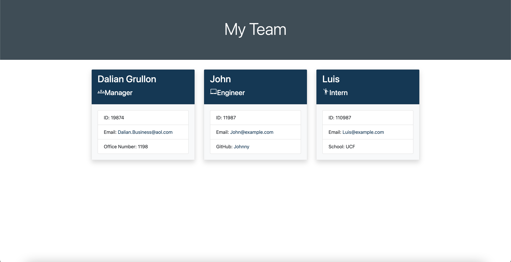

# Team Profile Generator


<br>

## Description

I created this command-line application to help software engineering managers keep track of their team members. It provides an easy to use interfrace that utilizes the Inquirer package via node.js.

In creating this project, I learned alot about Object-Oriented Programming and unit testing. My unit testing was done by using the Jest testing framework.

<br>

## Table of Contents

- [Installation](#installation)
- [Usage](#usage)
- [Tests](#tests)
- [License](#license)

<br>

## Installation


Once unzipped, enter integrated terminal on root level of project and run the following commands

```
npm install

node index.js
```

<br>

## Usage
Below includes a link to a walkthrough video that conveys this applications functionality. On a high level, this command-line application can be used by software engineering managers to generate a team roster consisting of engineers and interns.

<br>

[View walkthrough in Google Drive](https://drive.google.com/file/d/1loCuMdYb4HJUUroaf_fAy1FRoEZ876yp/view?usp=sharing)



<br>

## Tests

Tests are available in this application via Jest and aim to verify functionality of the classes created and stored in the `lib` folder.

To run the tests available in this repository, run the following command in the terminal on the root level of the application directory.

```
npm test
```

<br>

## License

    Copyright © 2022 Dalian Grullon

    Permission to use, copy, modify, and/or distribute this software for any purpose with or without fee is hereby granted, provided that the above copyright notice and this permission notice appear in all copies.

    THE SOFTWARE IS PROVIDED "AS IS" AND THE AUTHOR DISCLAIMS ALL WARRANTIES WITH REGARD TO THIS SOFTWARE INCLUDING ALL IMPLIED WARRANTIES OF MERCHANTABILITY AND FITNESS. IN NO EVENT SHALL THE AUTHOR BE LIABLE FOR ANY SPECIAL, DIRECT, INDIRECT, OR CONSEQUENTIAL DAMAGES OR ANY DAMAGES WHATSOEVER RESULTING FROM LOSS OF USE, DATA OR PROFITS, WHETHER IN AN ACTION OF CONTRACT, NEGLIGENCE OR OTHER TORTIOUS ACTION, ARISING OUT OF OR IN CONNECTION WITH THE USE OR PERFORMANCE OF THIS SOFTWARE.